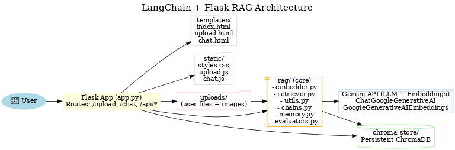

# LangChain-RAG-Flask

## Project Overview
LangChain-RAG-Flask is a **Flask + LangChain powered Retrieval-Augmented Generation (RAG) chatbot** that allows users to upload and index multiple documents (PDF, DOCX, TXT, CSV, PPTX). The system extracts both **text and images**, builds embeddings using Google Gemini, and enables interactive Q&A in a **WhatsApp-style chat UI**.  

The chatbot remembers previous messages (per session), references **figures/images when relevant**, and presents answers in a well-formatted, book-like style.  

---

## Key Features
- **Multi-document ingestion** (PDF, Word, CSV, TXT, PPTX).
- **Image-aware context**: extracts figures/screenshots with captions and references them in answers.
- **RAG-powered search**: uses ChromaDB vector store for efficient retrieval.
- **Conversational memory**: context-aware chat using `RunnableWithMessageHistory`.
- **Modern UI**: WhatsApp-style chat, embedded image gallery, and clean layout.
- **Formatted answers**: answers are structured with bullets, summaries, and figure references.
- **Production-ready**: modular design with `rag/` package for retriever & utils.

---

## 📂 Project Structure
```
langchain-rag-flask/
│
├── app.py                         # Flask routes & APIs (/upload, /chat, /api/*), session handling
├── config.py                      # Constants: UPLOAD_DIR, TOP_K, TEMPERATURE, MAX_TOKENS, CHROMA_DIR
├── requirements.txt               # Python deps (Flask, langchain, chromadb, google-genai, nltk, sacrebleu, etc.)
├── .env.example                   # Sample env vars (copy -> .env)
├── README.md                      # Project docs
├── Dockerfile                     # Optional containerization
├── Procfile                       # For Heroku/Render-style deploy
├── .gitignore                     # venv, __pycache__, uploads/, chroma_store/, .env, etc.
│
├── templates/                     # Pages (clean, separated)
│   ├── index.html                 # Home: cards linking to Upload & Chat
│   ├── upload.html                # Upload & Indexing (lists indexed docs)
│   └── chat.html                  # Chat UI (images + markdown + memory + back-to-home)
│
├── static/
│   ├── styles.css                 # Unified dark theme, chat bubbles, figure gallery
│   ├── upload.js                  # Upload flow + “Indexed Documents” list
│   └── chat.js                    # (optional) If you split chat JS out of chat.html
│
├── rag/                           # RAG core (modular & testable)
│   ├── __init__.py
│   ├── embedder.py                # GoogleGenerativeAIEmbeddings wrapper (one place to switch models)
│   ├── retriever.py               # Chroma init (persist), add_to_index (dedupe/upsert), query_index, list docs
│   ├── memory.py                  # RunnableWithMessageHistory session store helpers
│   ├── chains.py                  # Prompt(s) + LCEL pipeline (chat chain, fallback logic hooks)
│   ├── evaluators.py              # BLEU (nltk) + sacreBLEU; simple retrieval/answer overlay utilities
│   └── utils.py                   # load_and_split_with_images, chunking, hashing (file + chunk), helpers
│
├── uploads/                       # User uploads + extracted page assets (served via /uploads/<path>)
│   └── <auto-created per file>    # e.g., mydoc_assets/...
│
├── chroma_store/                  # Persistent ChromaDB directory (persist_directory)
│   └── <auto-created by Chroma>   # index data lives here across restarts
│
└── tests/
    ├── smoke.py                   # Quick sanity test of /api/upload, /api/indexed, /api/chat
    └── sample_questions.json      # (optional) prompts to test evaluation metrics

```

---

## ⚙️ Workflow
1. **Upload** → User uploads files via `/upload`.  
   - Text and images are extracted (`rag/utils.py`).  
   - Chunks are embedded using **GoogleGenerativeAIEmbeddings**.  
   - Stored in **ChromaDB** (deduplicated).  

2. **Index** → Indexed docs can be listed via `/api/indexed`.  

3. **Chat** → User asks questions in `/chat`.  
   - Relevant chunks retrieved via semantic search.  
   - Context injected into Gemini prompt.  
   - **Images referenced in context are displayed inline** in chat.  

4. **Memory** → Each browser tab/session has unique chat memory.  

---

## 🧠 Prompting Strategy
The system prompt ensures **clarity + formatting**:
- Ground answers only in retrieved context.  
- Mention **figures/images by number + caption** if relevant.  
- Summaries use bullets, short paragraphs, and one-line recaps.  
- If answer not in context → respond gracefully.  

---

## 📊 Business Value
- **Knowledge management**: Quickly extract insights from reports.  
- **Productivity booster**: Acts as an AI research assistant.  
- **Supports multimedia**: Unlike plain RAG, integrates images.  
- **Scalable**: Supports multiple docs with persistent embeddings.  
- **Deployable**: Works in local, Docker, or cloud.  

---

##  Setup Instructions

### 1. Clone Repository
```bash
git clone https://github.com/RajKumaar123/langchain-rag-flask.git
cd langchain-rag-flask
```

### 2. Setup Virtual Environment
```bash
python -m venv venv
source venv/bin/activate   # On Windows: venv\Scripts\activate
```

### 3. Install Dependencies
```bash
pip install -r requirements.txt
```

### 4. Configure Environment
Create `.env`:
```ini
GOOGLE_API_KEY=your_gemini_api_key
UPLOAD_DIR=uploads
TOP_K=5
TEMPERATURE=0.2
MAX_TOKENS=1024
```

### 5. Run App
```bash
python app.py
```
Open: [http://127.0.0.1:5000](http://127.0.0.1:5000)

---

## 🖼️ Architecture Diagram

- This diagram clearly shows the end-to-end flow:
👤 User → 🌐 Flask App → 📂 Upload & Parse Docs → 🧩 Embeddings → 🗄️ ChromaDB → 🔎 Retriever → 🤖 Gemini LLM → back to User.
---

##  Future Enhancements
- Auto-generate **flowcharts/diagrams** from docs.  
- Richer **image captioning & OCR integration**.  
- Multi-user chat sessions with authentication.  
- Deploy to **Streamlit, Hugging Face Spaces, or Render**.  

---


## ⚡ Summary
**LangChain-RAG-Flask** delivers a **production-style RAG chatbot** with a modern UI, persistent document embeddings, and **image-aware Q&A** powered by **Google Gemini + Flask + ChromaDB**.  
